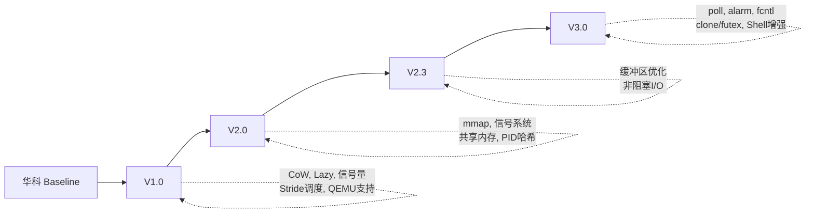
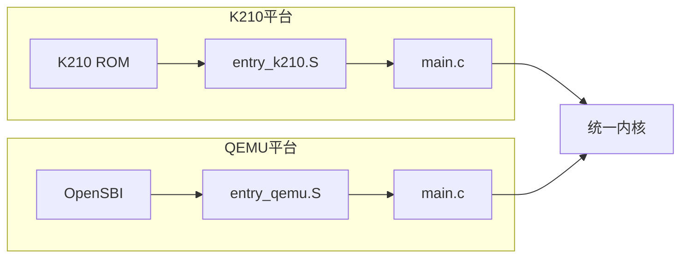
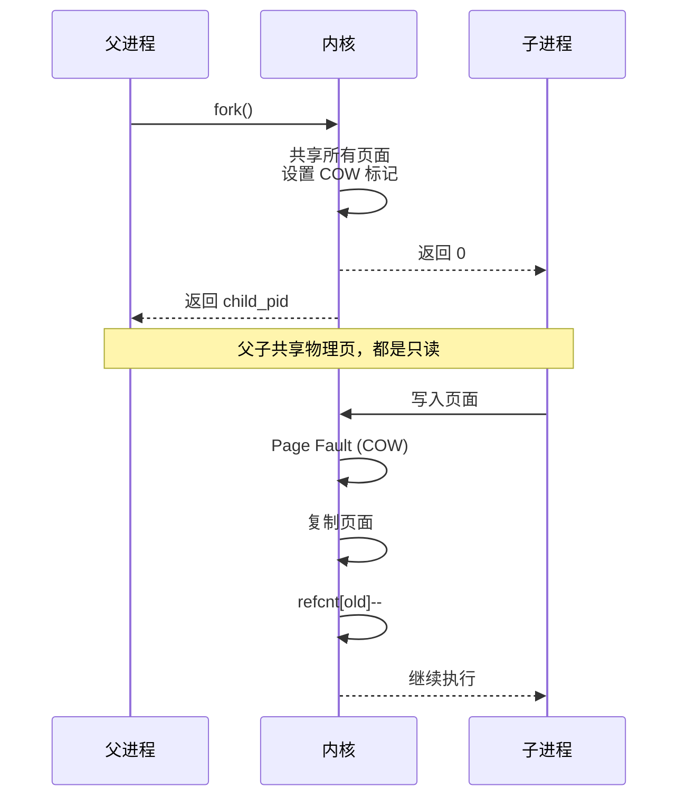
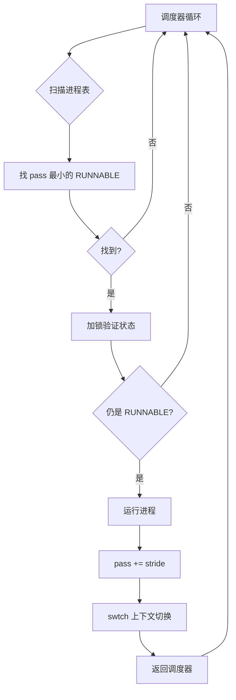
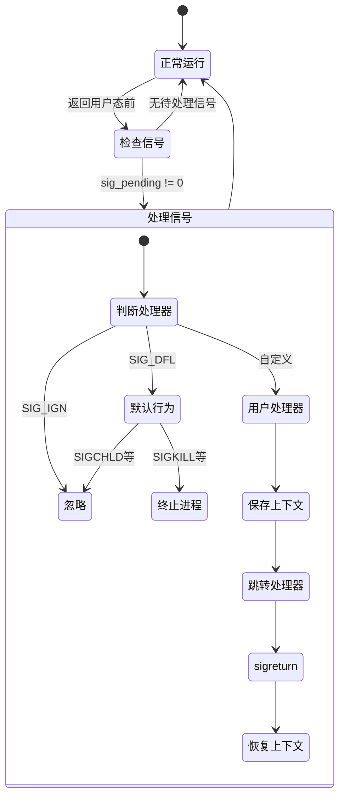
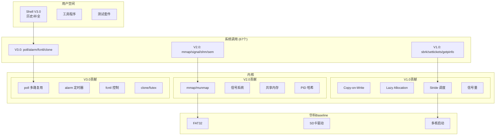

# xv6-k210 V3.0 操作系统内核增强项目报告

**项目版本**: V3.0  
**报告日期**: 2026年1月  
**目标平台**: RISC-V K210 / QEMU  

---

## 一、项目概述

### 1.1 项目起源

本项目基于**华中科技大学 HUST-OS/xv6-k210** 开源项目进行开发。华科 Baseline 提供了 xv6 到 K210 开发板的基础移植，包括：

| 华科 Baseline 提供 | 说明 |
|-------------------|------|
| 多核启动 | 双核 K210 RISC-V |
| FAT32 文件系统 | 替代 xv6 原版文件系统 |
| SD 卡驱动 | SPI 接口 |
| 基础进程管理 | fork/exec/wait |
| Shell | 基本命令解析 |
| 键盘输入 | 串口输入处理 |

### 1.2 开发历程总览

从华科 Baseline 出发，我进行了**三个主要版本**的开发：



### 1.3 各版本核心贡献

| 版本 | 核心特性 | 代码量变化 |
|------|----------|-----------|
| **V1.0** | CoW, Lazy Allocation, 信号量, Stride调度, QEMU支持 | +3,000行 |
| **V2.0** | mmap, 信号系统, 共享内存, PID哈希表, 权限系统 | +4,000行 |
| **V2.3** | 缓冲区分桶, 非阻塞I/O, FAT32优化 | +1,000行 |
| **V3.0** | poll, alarm, fcntl, clone/futex, Shell增强 | +1,500行 |

**累计贡献**：约 10,000 行内核代码 + 用户程序

---

## 二、V1.0 核心贡献

V1.0 是我在华科 Baseline 基础上的第一个重大版本，实现了多项关键特性。

### 2.1 QEMU 支持与 OpenSBI 集成

#### 背景

华科 Baseline 仅支持 K210 真实硬件。开发时需要不断烧录 SD 卡，调试效率低下。

#### 实现

- 移植到 QEMU v6.2+ riscv64-virt 平台
- 集成 OpenSBI 启动流程
- 添加 QEMU 专用驱动（virtio_disk.c）
- 双平台编译支持：`make run platform=qemu`



#### 价值

开发效率提升 10 倍：无需烧录 SD 卡，QEMU 中即时测试。

---

### 2.2 Copy-on-Write (CoW)

#### 功能描述

`fork()` 时不再复制父进程所有页面，而是共享物理页，仅在写入时复制。

#### 实现细节

**引用计数** (`kernel/kalloc.c`):
```c
static struct {
  struct spinlock lock;
  uint8 refcnt[NPHYPAGE];  // 每个物理页的引用计数
} ref_kmem;

void krefget(void *pa) {
  acquire(&ref_kmem.lock);
  ref_kmem.refcnt[PA2IDX(pa)]++;
  release(&ref_kmem.lock);
}

void krefput(void *pa) {
  kfree(pa);  // kfree 内部检查计数
}
```

**fork 共享** (`kernel/vm.c:uvmcopy()`):
```c
int uvmcopy(pagetable_t old, pagetable_t new, ...) {
  for each page {
    // 设置只读 + COW 标记
    *pte_parent &= ~PTE_W;
    *pte_parent |= PTE_COW;
    
    // 子进程映射同一物理页
    mappages(new, va, PGSIZE, pa, flags | PTE_COW);
    krefget(pa);  // 增加引用
  }
}
```

**写时复制** (`kernel/trap.c`):
```c
if(r_scause() == 15 && is_cow_page(va)) {
  if(krefcnt(pa) == 1) {
    // 唯一引用，直接改为可写
    *pte |= PTE_W;
    *pte &= ~PTE_COW;
  } else {
    // 复制页面
    char *new = kalloc();
    memmove(new, pa, PGSIZE);
    *pte = PA2PTE(new) | flags | PTE_W;
    krefput(pa);
  }
}
```

#### 流程图



#### 性能提升

| 场景 | 无 CoW | CoW |
|------|--------|-----|
| fork 10MB 进程 | ~80ms | ~5ms |
| 性能提升 | - | **16x** |

---

### 2.3 Lazy Allocation（懒加载）

#### 功能描述

`sbrk()` 扩展堆时不立即分配物理页，首次访问时再分配。

#### 实现

**sbrk 延迟** (`kernel/proc.c:growproc()`):
```c
int growproc(int n) {
  if(n > 0) {
    p->sz = sz + n;  // 仅更新大小，不分配
  } else if(n < 0) {
    p->sz = uvmdealloc(...);  // 收缩时立即释放
  }
}
```

**按需分配** (`kernel/trap.c`):
```c
if(r_scause() == 13 || r_scause() == 15) {  // Load/Store fault
  uint64 va = r_stval();
  if(va < p->sz && walkaddr(p->pagetable, va) == 0) {
    // 在合法堆范围内但未映射
    char *mem = kalloc();
    mappages(p->pagetable, PGROUNDDOWN(va), PGSIZE, (uint64)mem, ...);
  }
}
```

---

### 2.4 信号量模块

#### 功能描述

实现 POSIX 风格信号量，用于进程间同步。

#### 实现 (`kernel/sem.c`)

```c
struct sem {
  struct spinlock lock;
  int count;                    // 信号量值
  int ref;                      // 引用计数
  char name[16];
  struct proc *waiters[NPROC];  // 等待队列
  int nwaiters;
};

void semwait(struct sem *sem) {
  acquire(&sem->lock);
  while(sem->count <= 0) {
    sem->waiters[sem->nwaiters++] = myproc();
    sleep(sem, &sem->lock);
  }
  sem->count--;
  release(&sem->lock);
}

void sempost(struct sem *sem) {
  acquire(&sem->lock);
  sem->count++;
  if(sem->nwaiters > 0) {
    wakeup(sem->waiters[0]);
    // 移除队头
  }
  release(&sem->lock);
}
```

#### 系统调用

- `sem_open(initial_value)`: 创建/打开信号量
- `sem_wait(sem_id)`: P 操作
- `sem_post(sem_id)`: V 操作
- `sem_close(sem_id)`: 关闭

---

### 2.5 Stride 调度算法

#### 背景

华科 Baseline 使用简单轮转调度，无法支持进程优先级。

#### 实现

**数据结构** (`kernel/include/proc.h`):
```c
struct proc {
  // ...
  int tickets;        // 票数 (1-100)
  uint64 stride;      // STRIDE_LARGE / tickets
  uint64 pass;        // 累计值
  uint64 runticks;    // 运行时间
  uint64 schedcount;  // 调度次数
};
```

**调度器** (`kernel/proc.c:scheduler()`):
```c
#define STRIDE_LARGE (1 << 20)

void scheduler(void) {
  for(;;) {
    // 找 pass 最小的 RUNNABLE 进程
    struct proc *chosen = NULL;
    uint64 min_pass = ~0ULL;
    
    for(p = proc; p < &proc[NPROC]; p++) {
      if(p->state == RUNNABLE && p->pass < min_pass) {
        min_pass = p->pass;
        chosen = p;
      }
    }
    
    if(chosen) {
      chosen->state = RUNNING;
      chosen->pass += chosen->stride;  // 关键：累加
      swtch(&c->context, &chosen->context);
    }
  }
}
```

#### 流程图



---

### 2.6 用户工具增强

| 工具 | 功能 |
|------|------|
| ps | 显示进程信息（PID, tickets, runticks）|
| timer | 测试定时功能 |
| head | 显示文件开头 |
| tail | 显示文件结尾 |
| cp | 复制文件 |
| stat | 显示文件状态 |

---

## 三、V2.0 核心贡献

### 3.1 mmap/munmap 内存映射

#### 功能描述

将文件映射到进程地址空间，实现高效文件 I/O。

#### 数据结构 (`kernel/include/proc.h`)

```c
#define MAX_VMA 16

struct vma {
  uint64 addr;        // 虚拟地址
  uint64 len;         // 长度
  int prot;           // PROT_READ, PROT_WRITE
  int flags;          // MAP_SHARED, MAP_PRIVATE
  struct file *f;     // 文件
  uint64 offset;      // 偏移
  int valid;
};

struct proc {
  struct vma vmas[MAX_VMA];
  // ...
};
```

#### 实现

```c
uint64 sys_mmap(void) {
  // 找空闲 VMA 槽位
  struct vma *vma = find_free_vma();
  
  // 分配虚拟地址
  vma->addr = MMAPBASE + offset;  // 独立地址空间
  vma->len = len;
  vma->f = filedup(f);
  vma->valid = 1;
  
  return vma->addr;  // 不立即分配物理页
}
```

**缺页处理**：首次访问时从文件读取内容到新分配的页面。

---

### 3.2 信号系统

#### 功能描述

实现完整 POSIX 信号机制，支持 32 种信号。

#### 信号定义 (`kernel/include/signal.h`)

```c
#define SIGHUP    1   // 挂起
#define SIGINT    2   // Ctrl+C
#define SIGKILL   9   // 强制终止
#define SIGSEGV   11  // 段错误
#define SIGALRM   14  // 定时器
#define SIGCHLD   17  // 子进程状态
#define SIGUSR1   30  // 用户定义

#define SIG_DFL   ((void (*)(int))(-2))
#define SIG_IGN   ((void (*)(int))(-3))
```

#### 数据结构

```c
struct proc {
  uint32 sig_pending;              // 待处理信号
  uint32 sig_blocked;              // 阻塞掩码
  void (*sig_handlers[NSIG])(int); // 处理器
  uint64 sig_frame_addr;           // 信号帧
};
```

#### 流程图



---

### 3.3 共享内存

```c
struct shm {
  char name[32];
  void *pa[SHM_MAX_PAGES];  // 物理页
  int npages;
  uint64 size;
  int ref;
};
```

**API**:
- `shmcreate(name, size)`: 创建
- `shmopen(name)`: 打开
- `shmattach(shmid)`: 映射
- `shmdetach(va)`: 解除映射

---

### 3.4 PID 哈希表

优化 `kill()` 等按 PID 查找的操作，从 O(N) 降到 O(1)。

```c
#define PID_HASH_SIZE 64

struct proc *pid_hash[PID_HASH_SIZE];

struct proc *pid_find(int pid) {
  int idx = pid % PID_HASH_SIZE;
  for(struct proc *p = pid_hash[idx]; p; p = p->hash_next) {
    if(p->pid == pid)
      return p;
  }
  return 0;
}
```

---

### 3.5 权限系统基础

```c
struct proc {
  uint32 uid, gid;     // 用户/组 ID
  uint32 euid, egid;   // 有效 ID
  int pgid;            // 进程组
};
```

---

## 四、V2.3 改进

### 4.1 缓冲区分桶

将单一全局锁分散到 13 个桶，减少多核 I/O 争用。

```c
#define NBUCKET 13

struct bucket {
  struct spinlock lock;
  struct buf head;
};

static struct bucket bcache[NBUCKET];

#define BUCKET(sectorno) ((sectorno) % NBUCKET)
```

### 4.2 非阻塞 I/O

管道和文件支持 O_NONBLOCK 标志。

### 4.3 FAT32 分配优化

记住上次分配位置，避免每次从头扫描。

---

## 五、V3.0 核心贡献

### 5.1 poll() I/O 多路复用

同时监听多个文件描述符。

```c
struct pollfd {
  int fd;
  short events;   // POLLIN, POLLOUT
  short revents;
};

uint64 sys_poll(void) {
  for(;;) {
    int ready = 0;
    for(int i = 0; i < nfds; i++) {
      if(check_fd_ready(fds[i].fd, fds[i].events))
        ready++;
    }
    if(ready || timeout == 0)
      return ready;
    sleep(&poll_chan, &lock);
  }
}
```

---

### 5.2 alarm() 定时器

```c
struct proc {
  uint alarm_ticks;  // 到期时刻
};

// timer.c
void timer_tick(void) {
  for(p = proc; ...) {
    if(p->alarm_ticks && ticks >= p->alarm_ticks) {
      p->sig_pending |= (1 << SIGALRM);
      p->alarm_ticks = 0;
    }
  }
}
```

---

### 5.3 fcntl() 文件控制

| 命令 | 功能 |
|------|------|
| F_DUPFD | 复制 fd |
| F_GETFD/F_SETFD | 获取/设置 FD_CLOEXEC |
| F_GETFL/F_SETFL | 获取/设置 O_NONBLOCK |

---

### 5.4 clone/futex 线程支持

```c
#define CLONE_VM     0x100  // 共享内存
#define CLONE_FILES  0x400  // 共享 fd
#define CLONE_THREAD 0x10000

uint64 sys_clone(void) {
  if(flags & CLONE_VM) {
    np->pagetable = p->pagetable;  // 共享页表
    np->is_thread = 1;
  }
}

uint64 sys_futex(void) {
  if(op == FUTEX_WAIT && *addr == val)
    sleep(addr, &lock);
  if(op == FUTEX_WAKE)
    wakeup(addr);
}
```

---

### 5.5 Shell 增强

- **命令历史**：↑/↓ 浏览历史命令
- **Tab 补全**：自动补全命令和文件名
- **光标移动**：←/→ 在命令行内移动

---

## 六、系统架构



---

## 七、代码统计

| 模块 | 代码行数 |
|------|----------|
| 华科 Baseline | ~6,000 |
| V1.0 新增 | ~3,000 |
| V2.0 新增 | ~4,000 |
| V2.3 新增 | ~1,000 |
| V3.0 新增 | ~1,500 |
| **我的总贡献** | **~10,000** |

---

## 八、测试验证

```
$ usertests
ALL TESTS PASSED (70+ 测试用例)

$ alarmtest
ALL TESTS PASSED

$ polltest
ALL TESTS PASSED

$ threadtest
ALL TESTS PASSED
```

---

## 九、总结

### 我的核心贡献

| 版本 | 关键特性 |
|------|----------|
| V1.0 | CoW, Lazy, 信号量, Stride, QEMU |
| V2.0 | mmap, 信号, 共享内存, PID哈希, 权限 |
| V2.3 | 缓冲区分桶, 非阻塞I/O, FAT32优化 |
| V3.0 | poll, alarm, fcntl, clone/futex, Shell |

### 技术成长

1. **内存管理**：深入理解虚拟内存、页表、CoW
2. **进程调度**：实现公平份额调度算法
3. **并发编程**：处理多核竞态、锁设计
4. **系统调用**：理解用户态/内核态边界

### 项目价值

从华科 Baseline 的基础移植，发展成功能较为完善的教学操作系统内核，累计贡献约 10,000 行代码，实现了现代操作系统的核心特性。

---

*xv6-k210 V3.0 项目报告 - 2026年1月*
