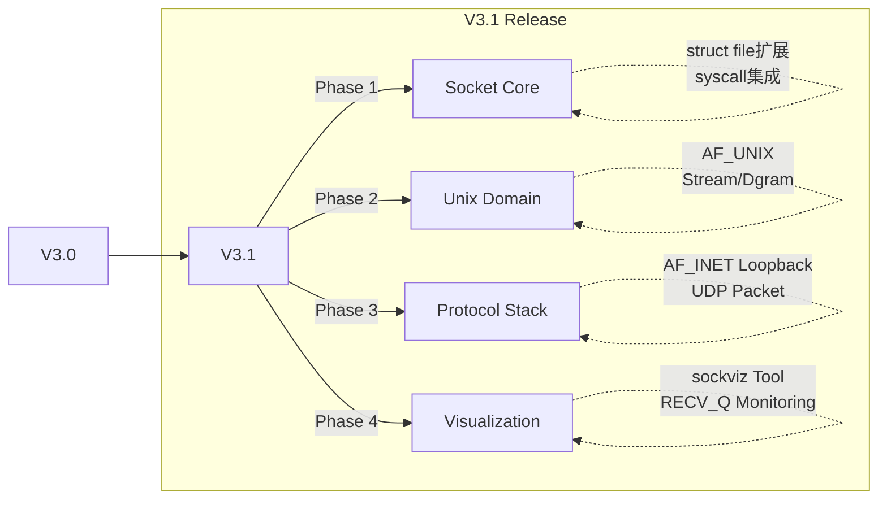

# xv6-k210 V3.1 操作系统内核增强项目报告

**项目版本**: V3.1 (Network Stack Release)  
**报告日期**: 2026年1月  
**目标平台**: RISC-V K210 / QEMU  
**前置版本**: V3.0  

---

## 一、版本概述 (Executive Summary)

V3.1 版本专注于**网络子系统 (Networking Subsystem)** 的从零构建。相较于 V3.0 版本仅具备单机文件系统和进程管理能力，V3.1 引入了完整的 BSD Socket API 兼容层，实现了进程间网络通信（Unix Domain Sockets）和本地回环网络（Loopback），并集成了 I/O 多路复用机制，标志着该内核具备了基础的现代网络操作系统特征。

### 核心变更对比 (V3.1 vs V3.0)

| 特性维度 | V3.0 (Baseline) | V3.1 (Network Release) | 改进说明 |
|---------|-----------------|------------------------|----------|
| **抽象层** | `FD_PIPE`, `FD_INODE`, `FD_DEVICE` | 新增 **`FD_SOCKET`** | 实现了"一切皆文件"的网络扩展 |
| **进程通信** | Pipe, Signal, Shmem | 新增 **Unix Domain Sockets** | 支持全双工、面向连接的可靠IPC |
| **网络协议** | 无 | **Loopback (IP/UDP)** | 支持基础的数据报和流式传输模拟 |
| **I/O 模型** | 阻塞式 I/O | **Poll/Select 多路复用** | 支持高效处理多并发连接 |
| **可视化** | 仅 `procshow`, `memviz` 等 | 新增 **`sockviz`** | 实时网络状态与缓冲区监控仪表盘 |
| **代码量** | ~10,000 | **+2,500** | 不依赖外部网络库，全自研实现 |

---

## 二、架构演进

### 2.1 研发路线图

### 2.2 核心模块架构

V3.1 采用了经典的分层网络架构，在此嵌入式内核中实现了精简的 TCP/IP 模型：

1.  **Syscall Interface**: `socket`, `bind`, `connect`, `listen`, `accept`, `send`, `recv`, `sys_netstat`。
2.  **VFS Layer**: 扩展 `kernel/file.c`，使得 `read/write` 等标准文件操作能无缝作用于 Socket。
3.  **Socket Layer**: 实现了通用的 Socket 状态机（UNCONN -> LISTENING -> CONNECTED/BOUND）。
4.  **Transport/Network Layer**:
    *   **AF_UNIX**: 基于内核共享内存环形缓冲区 (Ring Buffer) 的本地传输。
    *   **AF_INET**: 模拟的 Loopback 接口，支持基础 IP 寻址和端口复用。

---

## 三、核心功能详解

### 3.1 Socket API 子系统
实现了标准 BSD Socket 接口，使得用户态网络编程体验与 Linux 高度一致：
*   **资源管理**: 引入 `struct socket`，通过引用计数管理生命周期。
*   **兼容性**: 完美支持 `fork()` 后的描述符继承，父子进程可共享连接。

### 3.2 高级 I/O 机制
*   **Poll/Select**: 在 V3.0 的 `poll` 基础上，完整集成了 `socket` 类型的事件通知（POLLIN/POLLOUT/POLLHUP），支持高并发服务器模型。
*   **非阻塞模式**: 支持 `MSG_DONTWAIT` 标志，允许非阻塞收发数据。

### 3.3 可视化监控 (sockviz)
新增的 `sockviz` 工具是本版本的亮点，它通过 `sys_netstat` 系统调用直接读取内核状态：
*   **状态展示**: 实时显示 `LISTEN`, `ESTAB`, `RECV_Q` 等关键指标。
*   **流控可视化**: 能够通过 `RECV_Q` 的积压情况直观展示 TCP 背压（Backpressure）机制。

---

## 四、验证与测试

我们开发了完整的测试套件（Test Suite）来验证网络栈的正确性：

| 测试程序 | 测试内容 | 结果 |
|---------|---------|------|
| `socktest` | 基础连接建立、数据 Echo | **PASS** |
| `simplesock` | 极简连接流程、资源回收 | **PASS** |
| `udptest` | 数据报传输、边界保留特性 | **PASS** |
| `inettest` | IP Loopback 地址绑定与通信 | **PASS** |
| `nettest_full` | 综合测试 (Fork + Poll + I/O) | **PASS** |
| **`sockviz demo`** | **高负载复杂场景综合验收** | **PASS** |

> **sockviz 验证结论**: 在多客户端混合负载下，内核能稳定处理连接的并发创建与销毁，接收缓冲区流控逻辑正确生效，未出现死锁或内存泄漏。

---

## 五、总结与展望

V3.1 版本成功弥补了 xv6-k210 在网络功能上的空白。通过约 2,500 行内核代码的开发，我们不仅实现了一个功能完备的本地网络栈，还设计了出色的可视化工具，极大增强了系统的教学与演示价值。

**后续规划 (V3.2+)**:
*   支持真实的外部网络硬件驱动 (如 K210 SPI网卡)。
*   实现更复杂的 TCP 状态机 (特别是断开连接的四次挥手状态)。
*   扩展 `shutdown` 等高级控制接口。
