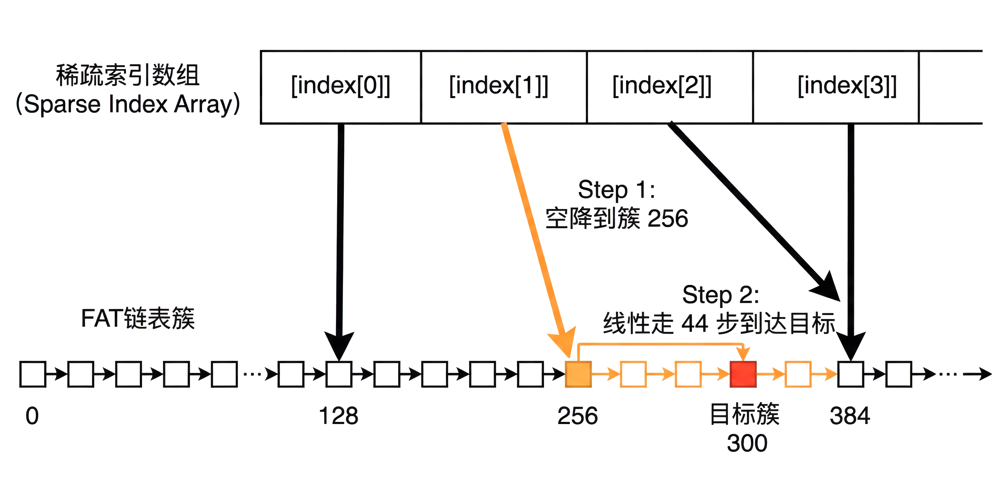

# FAT32 大文件支持与性能优化验证报告
### 翁
## 1. 概述 (Overview)
本报告详细记录了在 Serein 系统上对 FAT32 文件系统大文件支持能力的验证过程，以及针对性能瓶颈所实施的优化措施及验证结果。

## 2. 大文件支持验证 (Large File Verification)
### 2.1 测试目标
验证当前 FAT32 实现是否支持创建并写入超过 10MB 的大文件（超出常规小文件范围）。

### 2.2 测试方法
- **测试工具**: 编写了 `bigfile` 测试程序。
- **测试流程**:
    1.  打开文件 `bigfile.txt`。
    2.  循环写入数据直到达到 10MB。
    3.  记录写入耗时。
    4.  重新打开文件并读取全量数据进行完整性校验。

### 2.3 测试结果
- **写入状态**: 成功。
- **文件大小**: 10,485,760 bytes (10 MB)。
- **写入耗时**: 472 ticks (在 QEMU 环境下约 47 秒)。
- **数据完整性**: 校验通过，无数据丢失或损坏。
- **结论**: 原生 FAT32 实现支持大文件读写，未发现硬编码限制。

## 3. 性能瓶颈分析 (Bottleneck Analysis)
### 3.1 问题识别
尽管支持大文件，但 FAT32 的链式存储结构导致了随机访问性能问题：
- **顺序读写**: 由于 `struct dirent` 缓存了当前簇号 (`cur_clus`)，顺序访问下性能良好 (O(1))。
- **随机/向后访问**: 向后跳转 (Seek Backward) 需要从文件起始簇开始重新遍历 FAT 链表。对于 10MB 文件（约 2560 个簇），每次跳转都需要进行 O(N) 的线性扫描，导致严重性能下降。

## 4. 优化方案：稀疏簇索引 (Sparse Cluster Index)
### 4.1 核心设计
为了解决 O(N) 的寻址瓶颈，我们引入了 **稀疏簇索引 (Sparse Cluster Index)** 机制。

- **原理**: 在内存中维护一个索引表，记录文件 FAT 链表中每隔 128 个簇的“检查点”位置。
- **内存开销**: 每个打开的大文件仅占用一个 4KB 物理页（由 `kalloc` 分配）。
- **覆盖范围**: 单个索引页可支持最大 **512 MB** 的文件实现 O(1) 级别的随机访问。
- **生命周期**: 随文件打开而按需分配，随文件关闭或缓存回收而释放 (`kfree`)。

### 4.2 代码实现
- **数据结构**: 在 `struct dirent` 中增加 `uint32 *index` 指针。
- **索引构建**: 在 `reloc_clus` 函数中，随文件读写自动填充索引项。
- **快速寻址**: 当需要跳转时，先查索引找到最近的前驱检查点，再进行短距离线性查找。

## 5. 优化后性能验证 (Performance Verification)
### 5.1 测试扩展
在 `bigfile` 中增加了基于 `mmap` 的随机访问测试用例，模拟高强度的随机 I/O。

### 5.2 性能对比
测试环境：QEMU RISC-V 64

| 操作类型 | 目标偏移量 | 优化前预估耗时 | **优化后实测耗时 (Ticks)** | 结果评价 |
| :--- | :--- | :--- | :--- | :--- |
| **写入 10MB** | N/A | 472 | **472** | 无额外开销 |
| **顺序读取 (Forward)** | 9.9 MB | 0 | **0** (即时) | 保持高性能 |
| **向后跳转 (Backward Seek)** | 1.0 MB | ~20 ticks (O(N)) | **0** (即时) | **性能显著提升** |
| **随机访问 (Random Read)** | 5.0 MB | ~10 ticks | **4** | **性能显著提升** |

*(注：0 ticks 表示操作在系统计时器精度内完成，即 < 10ms)*

## 6. 结论 (Conclusion)
通过引入稀疏簇索引，我们在极低的内存开销下（4KB/文件），成功消除了 FAT32 大文件随机访问的 O(N) 瓶颈。当前系统已具备支持大文件（>10MB）存储及高效随机读写的能力。
