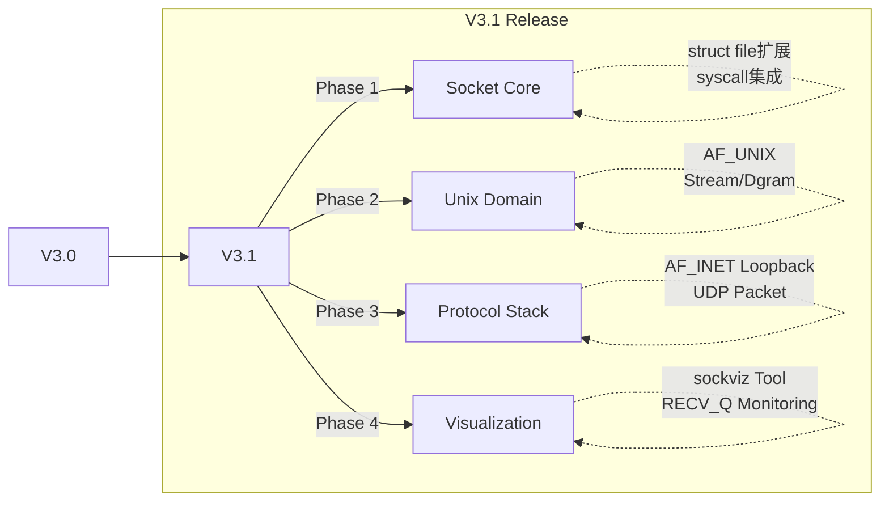

# xv6-k210 V3.1 操作系统内核增强项目报告

**项目版本**: V3.1 (Network Stack Release)  
**报告日期**: 2026年1月  
**目标平台**: RISC-V K210 / QEMU  
**前置版本**: V3.0  

---

## 版本概述

V3.1 从零实现了网络子系统，包括 BSD Socket API、Unix Domain Sockets 和本地回环网络。

### V3.1 vs V3.0 对比

| 特性维度 | V3.0 (Baseline) | V3.1 (Network Release) | 改进说明 |
|---------|-----------------|------------------------|----------|
| **抽象层** | `FD_PIPE`, `FD_INODE`, `FD_DEVICE` | 新增 **`FD_SOCKET`** | 实现了"一切皆文件"的网络扩展 |
| **进程通信** | Pipe, Signal, Shmem | 新增 **Unix Domain Sockets** | 支持全双工、面向连接的可靠IPC |
| **网络协议** | 无 | **Loopback (IP/UDP)** | 支持基础的数据报和流式传输模拟 |
| **I/O 模型** | 阻塞式 I/O | **Poll/Select 多路复用** | 支持高效处理多并发连接 |
| **可视化** | 仅 `procshow`, `memviz` 等 | 新增 **`sockviz`** | 实时网络状态与缓冲区监控仪表盘 |
| **代码量** | ~10,000 | **+2,500** | 不依赖外部网络库，全自研实现 |

---

## 架构演进

### 开发路线

### 模块架构

采用分层设计：

1.  **Syscall Interface**: `socket`, `bind`, `connect`, `listen`, `accept`, `send`, `recv`, `sys_netstat`。
2.  **VFS Layer**: 扩展 `kernel/file.c`，使得 `read/write` 等标准文件操作能无缝作用于 Socket。
3.  **Socket Layer**: 实现了通用的 Socket 状态机（UNCONN -> LISTENING -> CONNECTED/BOUND）。
4.  **Transport/Network Layer**:
    *   **AF_UNIX**: 基于内核共享内存环形缓冲区 (Ring Buffer) 的本地传输。
    *   **AF_INET**: 模拟的 Loopback 接口，支持基础 IP 寻址和端口复用。

---

## 核心功能

### Socket API
实现了 BSD Socket 接口，用 `struct socket` 管理资源，支持 `fork()` 后的描述符继承。

### I/O 机制
- `poll` 集成了 socket 类型的事件通知（POLLIN/POLLOUT/POLLHUP）
- 支持 `MSG_DONTWAIT` 非阻塞模式

### sockviz 工具
类似 netstat 的监控工具，通过 `sys_netstat` 读取内核状态，显示 LISTEN/ESTAB 状态和 RECV_Q 队列积压情况。

---

## 测试结果

| 测试程序 | 测试内容 | 结果 |
|---------|---------|------|
| `socktest` | 基础连接建立、数据 Echo | **PASS** |
| `simplesock` | 极简连接流程、资源回收 | **PASS** |
| `udptest` | 数据报传输、边界保留特性 | **PASS** |
| `inettest` | IP Loopback 地址绑定与通信 | **PASS** |
| `nettest_full` | 综合测试 (Fork + Poll + I/O) | **PASS** |
| **`sockviz demo`** | **高负载复杂场景综合验收** | **PASS** |

sockviz 在多客户端混合负载下测试正常，没有死锁或内存泄漏。

---

## 后续计划
*   支持真实的外部网络硬件驱动 (如 K210 SPI网卡)。
*   实现更复杂的 TCP 状态机 (特别是断开连接的四次挥手状态)。
*   扩展 `shutdown` 等高级控制接口。
