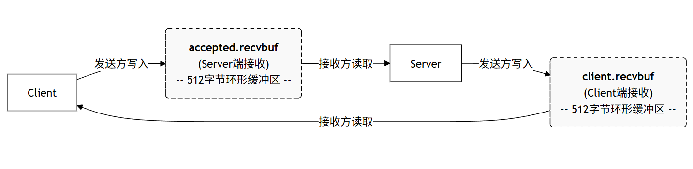

# Serein V3.1 Socket API 实现报告

## 概述
### 翁
记录 Serein V3.1 网络栈 Phase 1 的实现，包括 Unix Domain Socket 实现和调试过程中发现的 Bug 修复。

## 实现内容

### 新增文件

| 文件 | 功能 |
|------|------|
| `kernel/include/socket.h` | Socket 结构和常量定义 |
| `kernel/socket.c` | Socket 核心实现 |
| `kernel/syssocket.c` | Socket 系统调用封装 |
| `serein-user/socktest.c` | Unix Domain Socket 测试程序 |
| `serein-user/simplesock.c` | 简化的单进程 Socket 测试 |

### 修改的文件

| 文件 | 修改内容 |
|------|----------|
| `kernel/include/file.h` | 添加 `FD_SOCKET` 类型和 `socket` 字段 |
| `kernel/include/sysnum.h` | 添加 7 个 Socket 系统调用号 (68-74) |
| `kernel/syscall.c` | 注册 Socket 系统调用处理函数 |
| `kernel/file.c` | 在 `fileclose()` 中处理 socket 关闭 |
| `kernel/main.c` | 添加 `sockinit()` 初始化调用 |
| `serein-user/user.h` | 添加用户态 Socket API 声明 |
| `serein-user/usys.pl` | 添加系统调用存根生成 |
| `Makefile` | 添加 socket.o、syssocket.o 编译 |

---

## 已实现的 API

```c
int socket(int domain, int type, int protocol);
int bind(int sockfd, struct sockaddr *addr, int addrlen);
int listen(int sockfd, int backlog);
int accept(int sockfd, struct sockaddr *addr, int *addrlen);
int connect(int sockfd, struct sockaddr *addr, int addrlen);
int send(int sockfd, void *buf, int len, int flags);
int recv(int sockfd, void *buf, int len, int flags);
```

### 支持的地址族

- `AF_UNIX` - Unix Domain Socket (进程间通信)
- `AF_INET` - IPv4 (仅 loopback，预留)

### 支持的 Socket 类型

- `SOCK_STREAM` - 面向连接的可靠传输

---

## 调试过程与 Bug 修复

### Bug 1: `sys_bind` 和 `sys_connect` 缓冲区溢出

**问题描述**：
`sys_bind` 和 `sys_connect` 使用 `struct sockaddr`（16 字节）存储地址，但 `struct sockaddr_un` 需要 110 字节。

**症状**：
- `bind()` 失败
- 路径被截断

**修复**：
将缓冲区从 `struct sockaddr` 改为 `char addr[128]`。

---

### Bug 2: `sockinit()` 未调用

**问题描述**：
Socket 子系统的 spinlock 未初始化，`sockinit()` 定义了但从未在 `main.c` 中调用。

**症状**：
- Socket 操作时死锁
- 程序卡在 `send()` 调用

**修复**：
在 `main.c` 中 `fileinit()` 之后添加 `sockinit()` 调用。

---

### Bug 3: `sys_accept` 缓冲区溢出 (根本原因)

**问题描述**：
`sys_accept` 中使用 `struct sockaddr addr`（16 字节）接收 `sockaccept` 返回的地址数据，但 `sockaccept` 写入了 `sizeof(sockaddr_un)` = 110 字节，导致栈溢出。

**症状**：
- `accept()` 系统调用在内核中正确返回
- 但用户态代码在 `accept()` 返回后立即崩溃
- Panic 显示 `scause 0xf` (Store page fault)
- 崩溃地址 `stval=0x7d80001e8f` 为无效地址

**调试过程**：
1. 添加详细 printf 追踪 socket 操作流程
2. 发现 Server 进程从未打印 `accept()` 返回后的消息
3. 添加直接 `write()` 调用绕过 printf 缓冲
4. 创建 `simplesock` 简化测试程序
5. simplesock 触发了明确的 kernel panic
6. 分析 panic 日志定位到栈破坏

**修复**：
```c
// Before (Bug)
struct sockaddr addr;  // Only 16 bytes!

// After (Fixed)
char addr[128];  // Enough for sockaddr_un (110 bytes)
```

---

## 架构设计

### Socket 数据传输模型



采用类似 Pipe 的共享缓冲区模型：

```
Client Socket                    Server Socket (accepted)
+------------+                   +------------+
| peer_sock --------+    +-------- peer_sock |
| recvbuf[]  |      |    |       | recvbuf[]  |
+------------+      |    |       +------------+
                    v    v
            send() 写入 peer->recvbuf
            recv() 读取 self->recvbuf
```

### 连接建立流程

```
Server                          Client
------                          ------
socket() -> fd 3
bind("/tmp/sock")
listen(fd, 5)
accept(fd) --> blocks
                                socket() -> fd 3
                                connect("/tmp/sock")
     <-- wakeup --             
accept returns fd 4
recv(fd 4) --> blocks           send(fd 3, "hello")
     <-- wakeup --
recv returns "hello"
send(fd 4, "world")             recv(fd 3) --> blocks
                                     <-- wakeup --
                                recv returns "world"
```

---

## 测试结果

### socktest 输出

```
=== Unix Domain Socket Test ===

Server: Socket created (fd=3)
Server: Bound successfully
Server: Listening for connections
Client: Socket created (fd=3)
Client: Connected!
Server: Client connected (fd=4)
Client: Sending: Hello from client!
Server: Received: Hello from client!
Server: Echoed message back
Client: Received echo: Hello from client!
Server: Done
Client: Done
```

### simplesock 输出

### simplesock 输出

```
=== Simple Socket Test ===
1. Creating socket... socket() returned 3
3. Binding... bind() OK
5. Listening... listen() OK
7. Forking to create client...
8. Calling accept()...
[CLIENT] Connecting...
[CLIENT] Connected! Sending...
9. accept() returned 4
10. Calling recv()...
11. recv() returned 5
12. Received: HELLO
=== Test Complete ===
```

### inettest 输出 (IPv4 Loopback)

```
=== IPv4 Loopback Socket Test ===

[SERVER] Creating socket...
[SERVER] Socket created (fd=3)
[SERVER] Binding to 127.0.0.1:8080...
[SERVER] Bound successfully
[SERVER] Listening...
[SERVER] Waiting for connection...
[CLIENT] Creating socket...
[CLIENT] Socket created (fd=3)
[CLIENT] Connecting to 127.0.0.1:8080...
[CLIENT] Connected!
[SERVER] Client connected (fd=4)
[CLIENT] Sending: Hello via loopback!
[SERVER] Received: Hello via loopback!
[SERVER] Echoed message back
[CLIENT] Received echo: Hello via loopback!
[SERVER] Done
[CLIENT] Done
### udptest 输出 (UDP/DGRAM)

```
=== UDP/DGRAM Socket Test ===

[SERVER] Creating DGRAM socket...
[SERVER] Binding to /tmp/udp.sock...
[SERVER] Waiting for packets...
[CLIENT] Creating DGRAM socket...
[CLIENT] Connecting to /tmp/udp.sock...
[CLIENT] Sending Packet 1...
[CLIENT] Sending Packet 2...
[SERVER] Packet 1 received (5 bytes): Hello
[SERVER] Packet 2 received (5 bytes): World
[SERVER] Done
[CLIENT] Done

=== UDP Test Complete ===
```

### nettest_full 输出 (Advanced I/O Integration)

验证了 Socket与文件系统的深度集成（read/write/poll）：

```
=== Net Full Integration Test ===
[SERVER] Creating socket...
[SERVER] Polling on listen socket...
[CLIENT] Connected. Writing via write()...
[SERVER] Poll successful (POLLIN set)
[SERVER] Accepted client (fd=4)
[SERVER] Blocking read() from client...
[SERVER] Read via read(): Hello
[SERVER] Writing via write()...
[SERVER] Done
[CLIENT] Read reply: Reply
[CLIENT] Done

=== Test Complete ===
```

---

## 经验教训

1. **缓冲区大小必须匹配**：系统调用中用于接收可变长度数据的缓冲区必须足够大，否则会导致栈破坏。

2. **初始化函数必须调用**：定义了初始化函数后必须确保在启动时调用，否则相关数据结构（如 spinlock）将处于未定义状态。

3. **多核调试复杂性**：xv6 在 QEMU SMP 模式下运行时，进程调度的非确定性使得某些 Bug（如栈破坏）难以复现和定位。

4. **分层调试策略**：使用简化测试程序（simplesock）隔离问题比在复杂程序中调试更高效。

5. **UDP 消息边界**：在共享缓冲区模型中模拟 UDP 时，必须显式写入和读取 packet header（长度字段），否则接收端会像流一样读取数据，破坏 UDP 的数据报语义。

6. **I/O 多路复用集成**：将 Socket 集成到 `poll` 和标准 `read/write` 需要在 `file.c` 和 `sysfile.c` 中显式处理 `FD_SOCKET` 类型，这是实现"一切皆文件"的关键。

---

## 后续工作

- [x] 实现 AF_INET loopback (127.0.0.1) - **已完成**
- [x] 实现 SOCK_DGRAM (UDP-like) - **已完成**
- [x] 实现标准 I/O (read/write) 集成 - **已完成**
- [x] 实现 Poll/Select 多路复用 - **已完成**
- [x] 实现 sockviz 可视化监控 - **已完成**
- [ ] 添加 `shutdown()` 系统调用 (低优先级)

### sockviz 输出 (Visualization)

```
+================================================================+
|            Serein Socket Monitor (sockviz)              |
|                                                                |
|  Rounds: 5   / 30               Active Sockets: 5            |
+================================================================+

  [DEMO] 1. Streamer (RECV_Q High)   2. Pulser (Connect/Close) 

  TYPE   DOM    STATE      RECV_Q   LOCAL               REMOTE
  ----   ---    -----      ------   -----               ------
  STRM   UNIX   LISTEN     0        /tmp/viz.demo       
  STRM   UNIX   ESTAB      24       (unbound)           -> /tmp/viz.demo
  STRM   UNIX   ESTAB      12       /tmp/viz.demo       
  STRM   UNIX   ESTAB      0        (unbound)           -> /tmp/viz.demo
  STRM   UNIX   ESTAB      10       /tmp/viz.demo       
```
