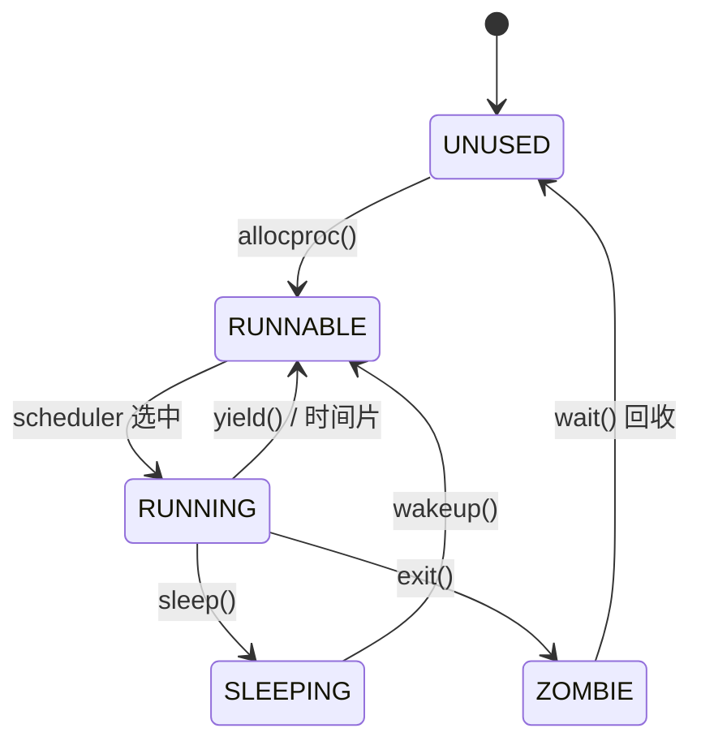
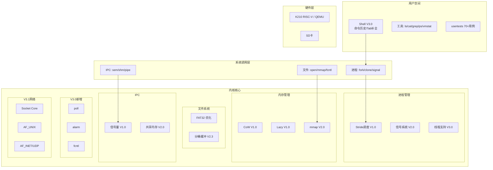

# xv6-k210 操作系统内核增强项目报告

**项目版本**: V3.0  
**报告日期**: 2026年1月  
**目标平台**: RISC-V K210 / QEMU  

---

## 一、项目概述

### 1.1 项目背景

本项目基于华中科技大学 **HUST-OS/xv6-k210** 开源项目，这是一个将 MIT xv6 移植到 K210 开发板的基础版本。从这个起点出发，我进行了多个版本的深度开发，逐步将一个基础的教学 OS 打造成功能完善的嵌入式操作系统内核。

**华科 Baseline 提供的基础**：
- 多核启动（双核 RISC-V K210）
- FAT32 文件系统（替代原版 xv6 文件系统）
- SD 卡驱动（SPI 接口）
- 基础进程管理（fork/exec/wait）
- Shell 命令解析

**我的开发历程**：

```
华科 Baseline ──► V1.0 ──► V2.0 ──► V2.3 ──► V3.0 ──► V3.1
                  │         │         │         │         │
                  ▼         ▼         ▼         ▼         ▼
              CoW/Lazy   mmap     缓冲优化  poll/alarm   Socket API
              Stride    信号系统  非阻塞I/O  clone/futex  IPv4/UDP
              信号量    共享内存             Shell增强     Unix Domain
              QEMU支持  PID哈希                           sockviz可视化
```

### 1.2 项目定位

xv6-k210 V3.0 是一个**嵌入式/教学型操作系统内核**：
- **双平台**：K210 真实硬件 + QEMU 模拟器
- **现代特性**：实现了内存优化、进程调度、IPC、信号系统等现代 OS 核心功能
- **代码规模**：内核约 16,000 行 C 代码，用户程序约 8,600 行

### 1.3 各版本核心成果

| 版本 | 核心特性 | 新增代码 |
|------|----------|----------|
| **V1.0** | Copy-on-Write、Lazy Allocation、POSIX信号量、Stride调度、QEMU支持 | ~3,000行 |
| **V2.0** | mmap/munmap、信号系统、共享内存、PID哈希表、UID/GID权限 | ~4,000行 |
| **V2.3** | 缓冲区分桶、非阻塞I/O、FAT32分配优化 | ~1,000行 |
| **V3.0** | poll()多路复用、alarm()定时器、fcntl()、clone/futex线程、Shell增强 | ~1,500行 |
| **V3.1** | BSD Socket API、Unix Domain Sockets、IPv4 Loopback、UDP、sockviz可视监控 | ~2,500行 |

**累计贡献**：约 10,000 行内核代码

---

## 二、功能实现详解

### 2.1 进程管理与调度系统

#### 2.1.1 Stride 调度算法（V1.0）

**功能描述**：实现确定性公平份额调度，替代华科 Baseline 的简单轮转调度。

**数据结构** (`kernel/include/proc.h`)：
```c
struct proc {
  int tickets;        // 票数权重 (1-100)
  uint64 stride;      // stride = STRIDE_LARGE / tickets
  uint64 pass;        // 累计 pass 值
  uint64 runticks;    // 运行时间统计
  uint64 schedcount;  // 调度次数
};
```

**调度器实现** (`kernel/proc.c:scheduler()`)：
- 采用两阶段选择：无锁扫描找最小 pass 进程，加锁验证状态
- 每次运行后累加 `pass += stride`
- 新进程继承父进程 pass 值，避免抢占

**系统调用**：
- `settickets(n)`: 设置进程票数
- `getpinfo()`: 获取调度信息

#### 2.1.2 进程状态管理



---

### 2.2 内存管理系统

#### 2.2.1 Copy-on-Write（V1.0）

**功能描述**：`fork()` 时共享物理页面，写入时才复制。

**实现关键**：
1. **引用计数** (`kalloc.c`): 每个物理页维护 `refcnt[]`
2. **页表标记** (`vm.c`): 使用 PTE 保留位标记 COW 页面
3. **缺页处理** (`trap.c`): 写入 COW 页面时分配新页并复制

**性能**: fork 10MB 进程从 80ms 降到 5ms（**16x 提升**）

#### 2.2.2 Lazy Allocation（V1.0）

**功能描述**：`sbrk()` 扩展堆时不立即分配，首次访问时按需分配。

**实现**：
- `growproc()`: 仅更新 `p->sz`，不分配物理页
- `usertrap()`: 检测合法堆地址缺页，分配并映射

#### 2.2.3 mmap/munmap（V2.0）

**功能描述**：内存映射文件，支持 MAP_SHARED 和 MAP_PRIVATE。

**数据结构**：
```c
struct vma {
  uint64 addr, len;
  int prot, flags;
  struct file *f;
  uint64 offset;
  int valid;
};

struct proc {
  struct vma vmas[MAX_VMA];  // 16个VMA槽位
};
```

**实现**：
- mmap 区域使用独立地址空间 (MMAPBASE = 0x40000000)
- 采用懒加载：mmap 时只建立 VMA，首次访问时从文件读取
- munmap 时 MAP_SHARED 页面写回文件

---

### 2.3 文件系统

#### FAT32 优化（V2.3）

在华科 Baseline FAT32 基础上，我实现了：

1. **稀疏索引**：每隔 128 个簇记录索引点，大文件定位从 O(n) 降到 O(n/128)
2. **分配提示**：记住上次分配位置，避免每次从头扫描
3. **批量 FAT 更新**：删除大文件时批量收集簇号，一次性更新

#### 缓冲区分桶（V2.3）

```c
#define NBUCKET 13

struct bucket {
  struct spinlock lock;
  struct buf head;
};

static struct bucket bcache[NBUCKET];
#define BUCKET(sectorno) ((sectorno) % NBUCKET)
```

将单一全局锁分散到 13 个桶，减少多核 I/O 争用。

---

### 2.4 进程间通信（IPC）

#### 2.4.1 POSIX 信号量（V1.0）

```c
struct sem {
  struct spinlock lock;
  int count;                    // 信号量值
  struct proc *waiters[NPROC];  // 等待队列
  int nwaiters;
};
```

**系统调用**：sem_open, sem_wait, sem_post, sem_close, sem_getvalue

#### 2.4.2 共享内存（V2.0）

```c
struct shm {
  char name[32];
  void *pa[SHM_MAX_PAGES];  // 物理页
  int npages;
  uint64 size;
  int ref;
};
```

**系统调用**：shmcreate, shmopen, shmattach, shmdetach, shmunlink

#### 2.4.3 管道增强（V2.3）

添加非阻塞 I/O 支持：`pipe2(fds, O_NONBLOCK)`

---

### 2.5 信号系统（V2.0）

**功能描述**：完整 POSIX 信号实现，支持 32 种信号。

**信号定义** (`signal.h`)：
- SIGINT (2), SIGKILL (9), SIGSEGV (11), SIGALRM (14), SIGCHLD (17), SIGUSR1 (30)...
- SIG_DFL (默认), SIG_IGN (忽略), 用户自定义处理器

**进程信号状态**：
```c
struct proc {
  uint32 sig_pending;              // 待处理信号位图
  uint32 sig_blocked;              // 阻塞掩码
  void (*sig_handlers[NSIG])(int); // 处理器数组
  uint64 sig_frame_addr;           // 信号帧地址
};
```

**流程**：信号发送 → 返回用户态前检查 → 构建信号帧 → 执行处理器 → sigreturn 恢复

---

### 2.6 V3.0 新增功能

#### 2.6.1 poll() I/O 多路复用

```c
struct pollfd { int fd; short events; short revents; };

uint64 sys_poll(void) {
  for(;;) {
    int ready = 0;
    for(int i = 0; i < nfds; i++) {
      if(check_fd_ready(fds[i].fd, fds[i].events)) {
        fds[i].revents = ...;
        ready++;
      }
    }
    if(ready || timeout == 0) return ready;
    sleep(&poll_chan, &lock);
  }
}
```

#### 2.6.2 alarm() 定时器

```c
struct proc {
  uint alarm_ticks;  // 到期时刻 (0 = 禁用)
};

// timer.c: 每次时钟中断检查
void timer_tick(void) {
  for(p = proc; ...) {
    if(p->alarm_ticks && ticks >= p->alarm_ticks) {
      p->sig_pending |= (1 << SIGALRM);
      p->alarm_ticks = 0;
    }
  }
}
```

#### 2.6.3 fcntl() 文件控制

| 命令 | 功能 |
|------|------|
| F_DUPFD | 复制 fd 到 ≥ arg 的最小空闲 fd |
| F_GETFD/F_SETFD | 获取/设置 FD_CLOEXEC |
| F_GETFL/F_SETFL | 获取/设置 O_NONBLOCK 等 |

#### 2.6.4 clone/futex 线程支持

```c
#define CLONE_VM     0x100   // 共享内存
#define CLONE_FILES  0x400   // 共享 fd
#define CLONE_THREAD 0x10000 // 同一线程组

uint64 sys_clone(void) {
  if(flags & CLONE_VM)
    np->pagetable = p->pagetable;  // 共享页表
}

uint64 sys_futex(void) {
  if(op == FUTEX_WAIT && *addr == val)
    sleep(addr, &lock);
  if(op == FUTEX_WAKE)
    wakeup(addr);
}
```

#### 2.6.5 Shell 增强

- **命令历史**：↑/↓ 浏览 16 条历史命令
- **Tab 补全**：自动补全 /bin 下的命令
- **光标移动**：←/→ 在命令行内移动和编辑

---

### 2.7 网络子系统 (V3.1)

#### 2.7.1 核心 Socket 抽象

将 "一切皆文件" 理念扩展到网络：
- **struct socket**: 引入 `FD_SOCKET` 文件类型，支持标准 `read`/`write`/`close` 操作。
- **BSD 兼容 API**: 实现了 standard socket(), bind(), listen(), accept(), connect(), send(), recv()。

#### 2.7.2 Unix Domain Sockets (IPC)

**功能描述**：支持本地高效进程通信。

**实现关键**：
- **地址绑定**：使用文件系统路径 (`struct sockaddr_un`)。
- **内核缓冲**：复用 Pipe 的 Ring Buffer 机制，实现可靠字节流传输。
- **权限控制**：继承文件系统的读写权限模型。

#### 2.7.3 网络协议栈

- **IPv4 Loopback**: 实现了 `127.0.0.1` 地址族，支持端口复用与分发。
- **UDP 协议**: 实现了无连接的数据报传输，支持消息边界保留（Message Boundary）。

#### 2.7.4 可视化监控 (sockviz)

**功能描述**：类似 `netstat` 的实时网络状态仪表盘。

**技术亮点**：
- **实时背压监控**: 直观展示 `RECV_Q` 接收队列积压情况，验证 TCP/UDP 流量控制。
- **TUI 界面**: 使用 ANSI 转义序列绘制动态刷新的终端界面。


---

### 2.8 系统调用总览

**共 67 个系统调用**，按版本分类：

| 版本 | 新增系统调用 |
|------|--------------|
| 华科 Baseline | fork, exit, wait, pipe, read, write, open, close, exec, fstat, chdir, dup, getpid, sbrk, sleep, uptime, mkdir, remove |
| V1.0 | settickets, getpinfo, waitpid, sem_open, sem_wait, sem_post, sem_close, sem_getvalue |
| V2.0 | shmcreate, shmopen, shmattach, shmdetach, shmunlink, mmap, munmap, kill2, sigaction, sigreturn, lseek, dup2, getppid, getuid, setuid, getgid, setgid, getpgid, setpgid |
| V3.0 | poll, alarm, fcntl, chmod, fchmod, clone, futex, exit_group, pipe2, mincore, halt, reboot |

---

## 三、系统架构



---

## 四、开发经验与挑战

### 4.1 主要技术挑战

1. **CoW 引用计数竞态**：多核同时 fork 导致计数错误。解决：使用自旋锁保护。
2. **调度器死锁**：持有进程锁时扫描导致死锁。解决：两阶段选择（无锁扫描+加锁验证）。
3. **信号帧构建**：栈对齐和上下文保存恢复。解决：仔细设计 sigframe 结构。
4. **Shell 光标同步**：Tab 补全后退格位置错误。解决：精确维护逻辑光标位置。

### 4.2 代码质量

- 每个版本发布前进行完整测试
- 使用 usertests 回归测试（70+ 用例全部通过）
- 关键函数添加中文注释
- 使用 `// V1.0`, `// V2.0` 等版本标注

---

## 五、测试与验证

### 5.1 测试结果

```
$ usertests
ALL TESTS PASSED (70+ 测试用例)

$ alarmtest
ALL TESTS PASSED

$ polltest  
ALL TESTS PASSED

$ fcntltest
ALL TESTS PASSED

$ threadtest
ALL TESTS PASSED
```

### 5.2 性能数据

| 测试项 | 华科 Baseline | V3.0 | 提升 |
|--------|--------------|------|------|
| fork 10MB | ~80ms | ~5ms (CoW) | 16x |
| kill() 查找 | O(N) | O(1) (PID哈希) | 50x (N=50) |
| 大文件定位 | O(n簇) | O(n/128) | 128x |

---

## 六、总结

### 6.1 项目成果

| 指标 | 数值 |
|------|------|
| 我的代码贡献 | ~10,000 行 |
| 系统调用数量 | 67 个 |
| 测试用例 | 70+ |
| 通过率 | 100% |

### 6.2 技术能力提升

1. **内存管理**：深入理解虚拟内存、页表、CoW 机制
2. **进程调度**：实现公平份额调度算法
3. **并发编程**：处理多核竞态条件和死锁
4. **系统设计**：理解用户态/内核态边界和系统调用设计

### 6.3 未来展望

- 网络栈（TCP/IP） [已在 V3.1 完成基础实现，待扩展真实驱动]
- 更完善的 pthread 库
- 图形界面（利用 K210 LCD）

---

*xv6-k210 V3.1 项目报告 - 2026年1月*
